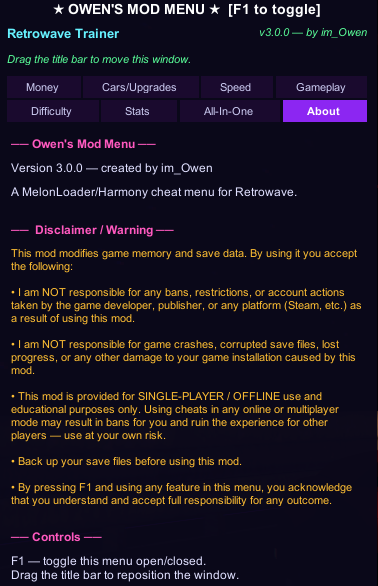
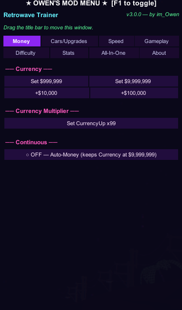
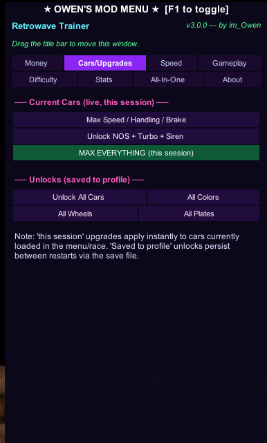
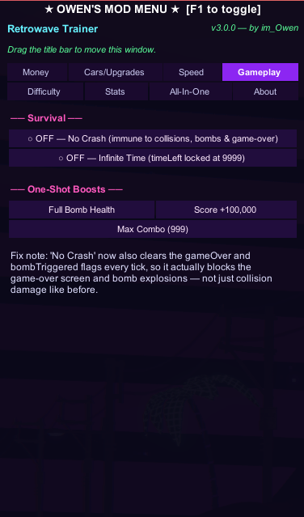
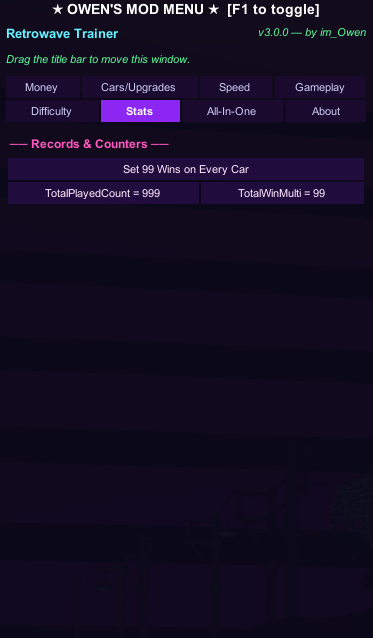

# Owen's Mod Menu for Retrowave

<p align="center">
  <strong>A polished single-player mod menu for Retrowave.</strong><br>
  Money tools, vehicle unlocks, upgrade utilities, gameplay options, traffic controls, and progression helpers built for offline sandbox play.
</p>

<p align="center">
  
  
  
  
  
</p>

<p align="center">
  <a href="../../releases/latest"><strong>Download Latest Release</strong></a>
  ·
  <a href="#installation">Installation</a>
  ·
  <a href="#features">Features</a>
  ·
  <a href="#screenshots">Screenshots</a>
  ·
  <a href="#disclaimer">Disclaimer</a>
</p>

---

## Overview

**Owen's Mod Menu for Retrowave** is an unofficial single-player mod menu designed to give players more control over progression, vehicle customization, money, upgrades, traffic settings, and gameplay utilities.

The goal of the project is to reduce grind, make testing easier, and provide a clean in-game toolset for offline sandbox-style play. The menu runs through **MelonLoader** and can be opened in-game with **F1**.

> This project is intended for **offline, single-player, personal, and educational modding use only**.

---

## Preview


<p align="center">
  <em>Quick preview of the mod menu running in-game.</em>
</p>

---

## Project status

| Category | Status |
| --- | --- |
| Current version | `3.0.0` |
| Loader | `MelonLoader v0.4.3.0` |
| Platform | Windows |
| Tested game build | `Retrowave v2021.2.14.15834644` |
| Release state | Stable release |
| Menu hotkey | `F1` |
| Intended use | Offline single-player |

---

## Screenshots

<p align="center">
  
  
  
  
  
</p>

---

## Features

### Menu system

- Draggable in-game interface.
- F1 menu toggle.
- Auto-save configuration support.
- Crash and loss protection toggles.
- Clean tab-based layout for different tool categories.

### Money tools

- Set currency to `$999,999`.
- Set currency to `$9,999,999`.
- Add `$10,000` instantly.
- Use currency multipliers.
- Enable Auto-Money to keep funds locked at a high value.

### Vehicle upgrades

- Max speed.
- Max handling.
- Max brakes.
- Unlock NOS.
- Unlock Turbo.
- Unlock Siren.
- Max upgrades on the selected vehicle.
- Max upgrades on every vehicle.
- Adjust vehicle speed values.

### Vehicle unlocks

- Unlock all cars.
- Unlock all colors.
- Unlock all wheels.
- Unlock all license plates.

### Gameplay utilities

- Max Drive combo.
- Max bomb health.
- Add `100,000` Drive score.
- Change traffic difficulty.
- Use progression and run-management helpers.

### Traffic settings

- Peaceful.
- Easy.
- Normal.
- Hard.
- Mega.

### Statistics tools

- Modify wins per vehicle.
- Edit total games played.
- Adjust win multipliers.
- Use progression-related tools.

---

## Installation

### Requirements

- Retrowave on PC.
- Windows.
- MelonLoader `v0.4.3.0`.
- The latest compiled mod DLL from this repository's Releases page.

### Install steps

1. Install **MelonLoader v0.4.3.0** for Retrowave.
2. Launch Retrowave once so MelonLoader can generate its folders.
3. Close the game.
4. Open the Retrowave installation directory.
5. Open the `Mods` folder.
6. Place the compiled mod `.dll` inside `Mods`.
7. Launch Retrowave normally.
8. Press **F1** in-game to open the menu.

### Example install layout

```text
Retrowave/
├── MelonLoader/
├── Mods/
│   └── OwensRetrowaveModMenu.dll
├── UserData/
└── Retrowave.exe
```

---

## Download

Download the latest compiled `.dll` from the [GitHub Releases page](../../releases/latest).

Each release may include a matching `sourcecode.zip` archive so users can review the code for transparency.

---

## Recommended setup

For the cleanest experience:

- Back up your save data before installing or updating.
- Use the tested MelonLoader version listed above.
- Avoid mixing files from different releases.
- Download only from this repository.
- Review release notes before updating.
- Keep a copy of your original save if you plan to edit progression values.

---

## Compatibility

| Target | Supported |
| --- | --- |
| Retrowave PC | Yes |
| Windows | Yes |
| MelonLoader `0.4.3.0` | Yes |
| Offline single-player | Yes |
| Multiplayer / online use | Not supported |
| Leaderboards / competitive systems | Not supported |

Compatibility with future game updates is not guaranteed. If the game receives an update that changes internal fields, save behavior, or runtime systems, some features may require a mod update.

---

## Known notes

- Some changes may require an in-game UI refresh before they appear visually.
- Save-editing and progression tools should be used carefully.
- Always back up saves before making large progression changes.
- Online progression, public multiplayer, leaderboard manipulation, and competitive use are not supported targets of this project.

---

## Safety and transparency

This project is intended to be transparent and user-checkable.

- Download builds only from this repository's Releases page.
- Review included source archives when available.
- Scan downloaded files before installing if desired.
- Keep save backups before using progression tools.
- Use only in offline single-player contexts.

No malware, spyware, viruses, or intentionally harmful code are included in this project. Users are encouraged to review, scan, and verify files before use.

---

## Changelog

Version history and update notes are available on the [GitHub Releases page](../../releases).

---

## Disclaimer

This project is an unofficial fan-made modification for **Retrowave** and is not affiliated with, endorsed by, sponsored by, or associated with the game's developers or publishers.

This mod is provided **as is** without warranty of any kind. By downloading, installing, or using this software, you acknowledge and accept all risks associated with modding, including crashes, instability, corrupted saves, progression issues, restrictions, account actions, or other unintended behavior.

This project is intended for **offline, single-player, and sandbox-style gameplay experimentation only**.

Using this modification in multiplayer environments, online services, public leaderboards, or competitive systems is not supported and may violate the game's terms of service or negatively affect other players.

The author does not support cheating in public multiplayer sessions and is not responsible for bans, restrictions, account actions, corrupted saves, crashes, instability, or any other consequences resulting from use of this software.

Use at your own risk.
